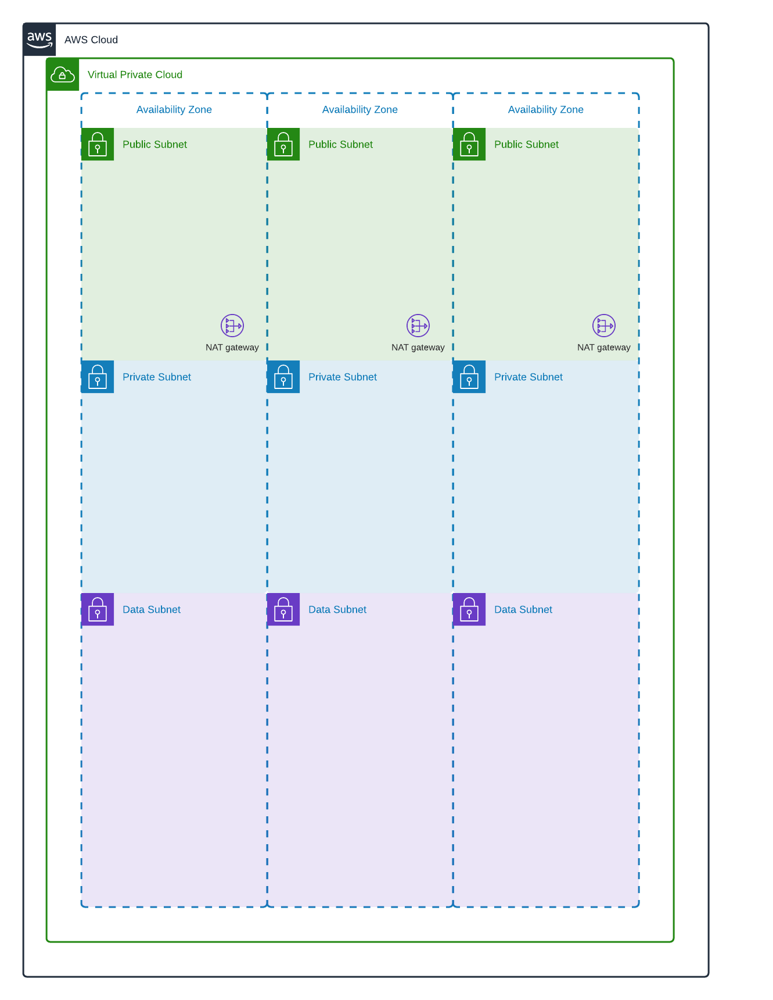
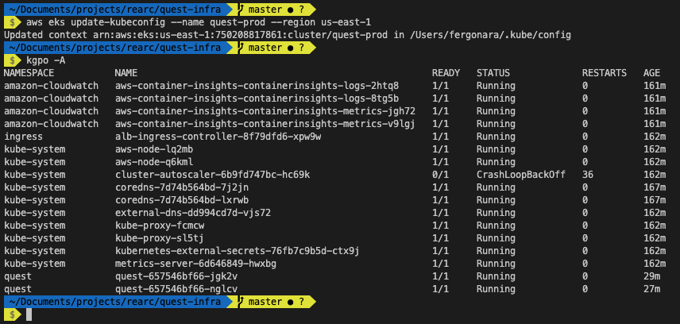
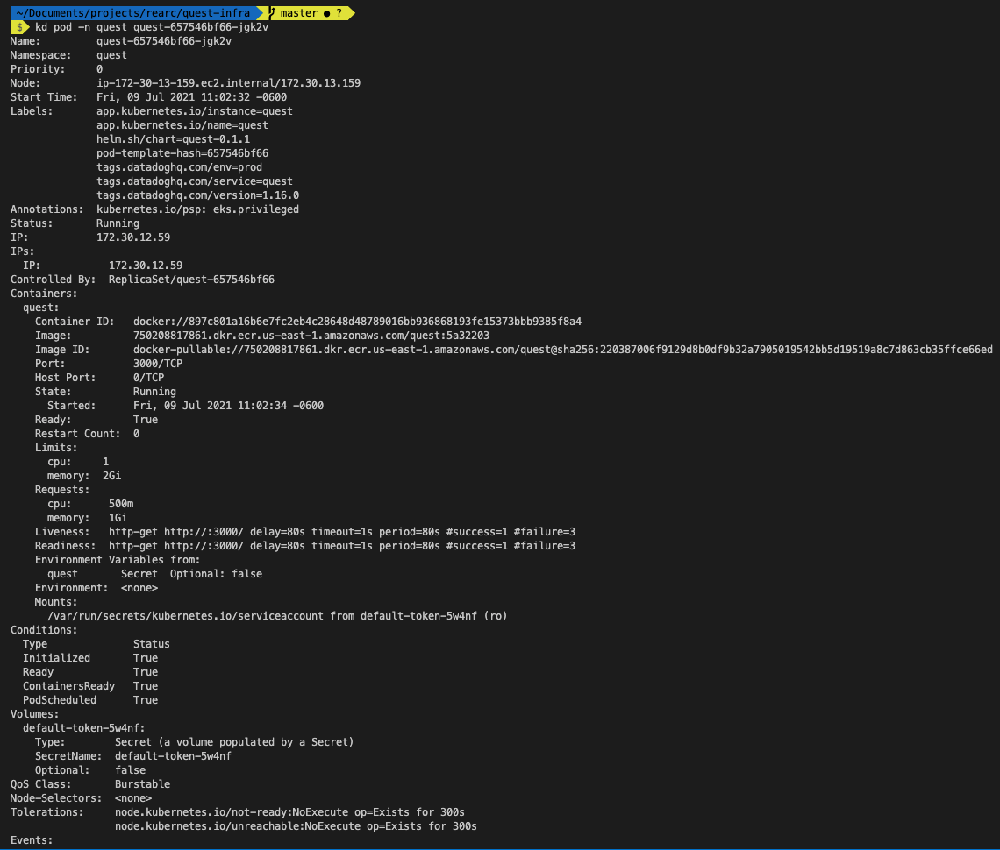
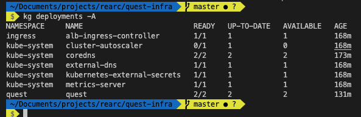

# REARC QUEST INFRA by fergo

This repository contains all the terraform templates to recreate the environment. The following modules are used for the environment:

- VPC
- ECR
- Route53
- EKS
- IAM

## VPC
Creates a vpc spread in 3 AZ's with public, private and database subnets.
Uses a single NAT gateway (configurable to each Nat per AZ)
Route tables and further configuration can be done using transit gateway.



## ECR
Creates a repository to store docker images

## Route53
Create a public hosted zone and is managed by Terraform plugin external-dns

## IAM
Basic configuration for RBAC and Circle CI user automated to Parameter Store

## EKS
The EKS module is a high available and high configurable module using Helm under the hood. It contains:

- EKS Cluster
- EC2 Auto Scaling
- EC2 Security Groups
- IAM Roles & Policies
- CloudWatch log groups

### Plugins installed automatically

- aws-alb-ingress-controller
- kubernetes-external-secrets
- cluster-autoscaler
- external-dns
- metrics-server
- aws-container-insights

Each time a deployment from terraform is done all these plugin are render and apply to the cluster.
The manifest and variables are defined in the folders:
```
helm_values
modules/eks/helm_charts
module/eks/helm_values
```

## How is the app deployed

### Helmfile
The helmfile is configure to render all the templates in the [Helm folder](https://github.com/fergo2910/quest/tree/master/helm/quest) of the application.

Each apply will render:
1. Service Account (if it is not created already)
2. External Secrets (Connection with System Manager Parameter Store to inyect the parameters to the pod)
2. Deployment of the application
3. Service to expose the pods
4. Ingress controller which is in charge to bing up a ALB and configure target groups and SSL certificates
5. HPA to scale the application on CPU metrics

### PODS
All these configurations re-creates the following state:\


### APP
The application is decribe as follow:\


### Deployments
The deployments running:\
